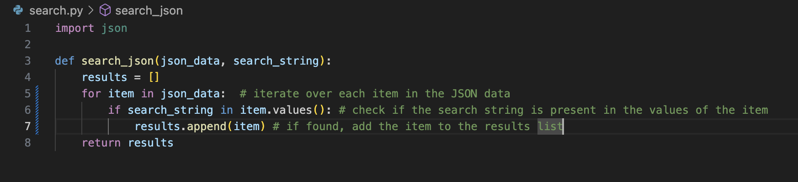
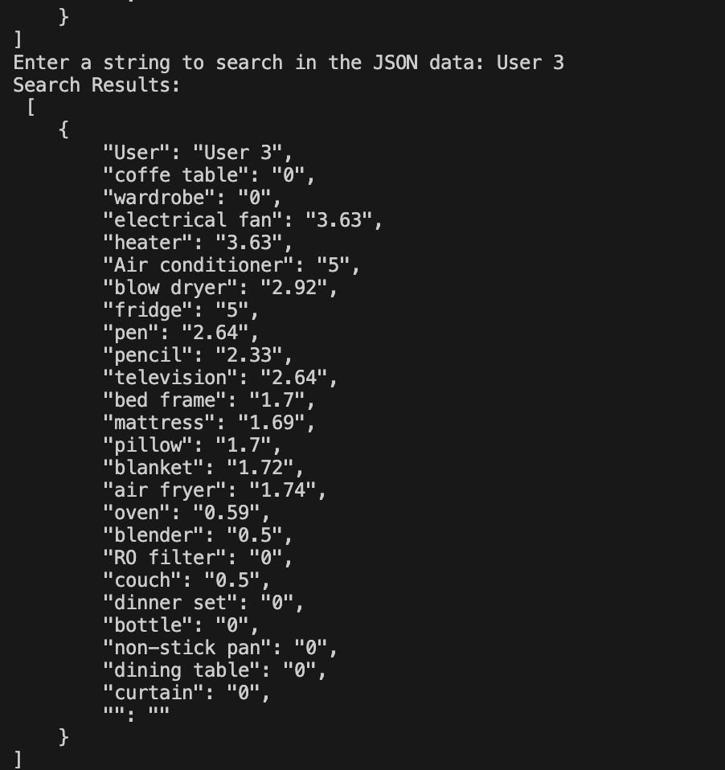

# GIT practice assignment

A basic for loop that iterates through the json_data list items and appends the matching item to the results. Once a match is found, the code returns the item. However, it lacks error-checking capabilities.

[Link to forked repo](https://github.com/mobajemu/github-lab1)

img 1: search function code snippit.

img 2: results printed in terminal.

